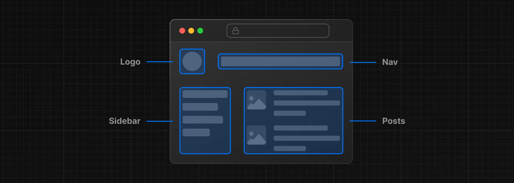
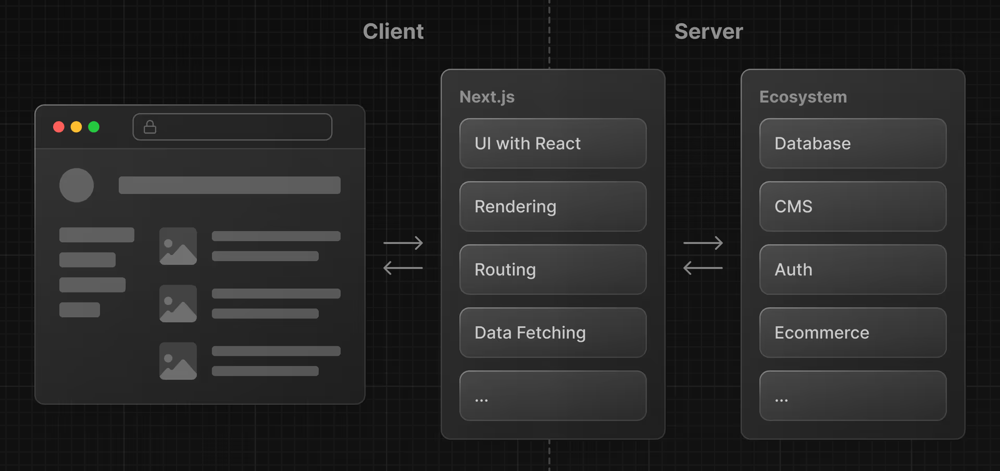
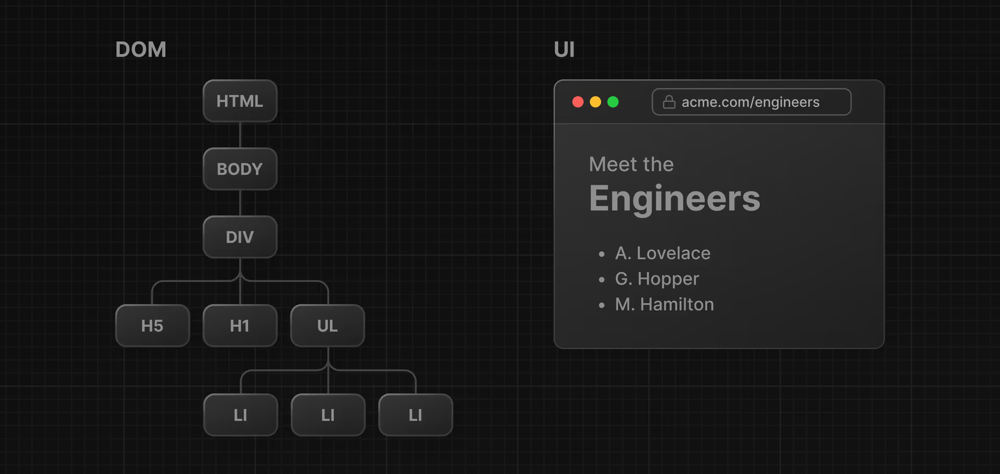
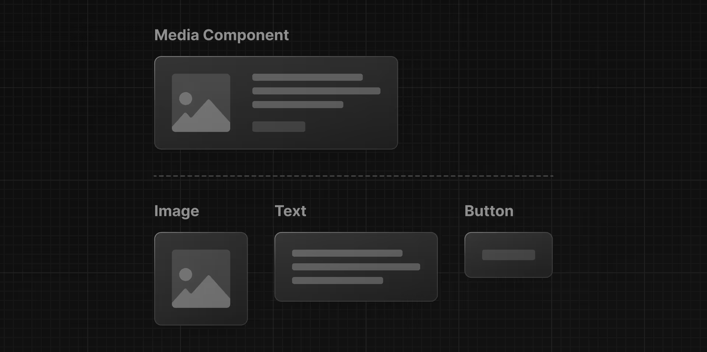
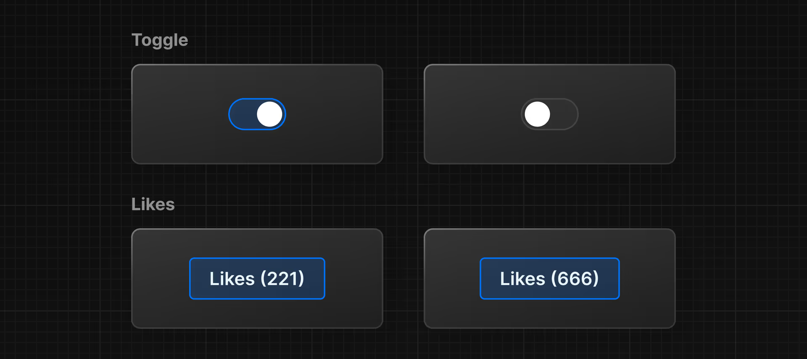
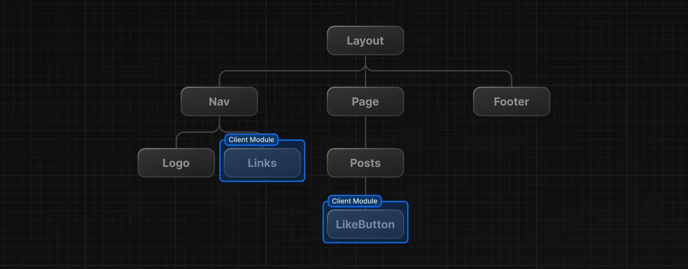

# Chapter 1

## Web 应用的构建

在构建现代应用程序时，需要考虑的是：

- 用户界面：用户如何与程序进行交互。
- 路由：用户如何在应用程序的不同部分之间导航。
- 数据获取：数据所在的位置以及如何获取。
- 渲染：渲染静态或动态内容的时间和位置。
- 集成：使用的第三方服务（用于 CMS、身份验证、支付等）以及如何连接到它们。
- 基础设施：部署、存储和运行应用程序代码（无服务器、CDN、边缘等）的地方。
- 性能：如何为最终用户优化应用程序。
- 可拓展性：应用程序如何随着团队、数据和流量的增长而适应
- 开发体验：团队在构建和维护应用程序方面的经验。

## 什么是 React？

React 是一个 JavaScript 库，用于构建用户界面。

React 允许你创建具有 interactivity 的动态用户界面，这些界面可以动态地更新，而不需要重新加载整个页面。

我们所说的库是指 React 提供有用的函数 （API） 来构建 UI，但将其留给开发人员在他们的应用程序中如何使用这些函数。



## 什么是 Next.js？

Next.js 是一个用于构建全栈 JavaScript 应用程序的 React 框架。

框架是指 Next.js 处理 React 所需的工具和配置，并为您的应用程序提供额外的结构、功能和优化。



# Chapter 2

## 什么是 DOM？

DOM（Document Object Model）是 HTML 和 XML 文档的编程接口。

我们可以使用 DOM 方法和 JavaScript 来监听用户事件，并通过在用户界面中选择、添加、更新和删除特定元素来操作 DOM。



# Chapter 3

## 用 JavaScript 更新 UI

```html
<html>
  <body>
    <div id="app"></div>
    <script type="text/javascript">
      // 获取 id 为 app 的元素
      const app = document.getElementById("app");
      // 创建 h1 和 text 标签
      const header = document.createElement("h1");
      const text = "Develope. Preview. Ship. 🚀";
      const headerContent = document.createTextNode(text);
      header.appendChild(headerContent);
      // 将标签添加到 app 中
      app.appendChild(header);
    </script>
  </body>
</html>
```

## 命令式编程与声明式编程

命令式编程：以命令的形式编写程序，告诉计算机如何执行任务。
声明式编程：以声明的形式编写程序，告诉计算机要执行的任务。

上面的代码是 `命令式编程` ，但是，在构建用户界面时，通常首选 `声明式方法` ，因为它可以加快开发过程。如果开发人员能够声明他们想要显示的内容，而不是编写 DOM 方法，那将会很有帮助。

换句话说，命令式编程就像给厨师分步指导如何制作披萨。声明式编程就像订购披萨，而不关心制作披萨所需的步骤。🍕

React 就是一个流行的声明式库，我们可以用它来构建用户界面。

# Chapter 4

## React 入门

```html
<script src="https://unpkg.com/react@18/umd/react.development.js"></script>
<script src="https://unpkg.com/react-dom@18/umd/react-dom.development.js"></script>

<scirpt>
  const app = document.getElementById('app'); const root =
  ReactDOM.createRoot(app); root.render(
  <h1>Hello React!</h1>
  );
</scirpt>
```

通过 `ReactDOM.createRoot()` 创建根元素，然后使用 `root.render()` 将内容渲染到根元素中。

然而上面的代码是不能运行的，因为 `<h1>...</h1>` 是无效的 JavaScript，这段代码其实是 `JSX`。

## 什么是 JSX

JSX 是 JavaScript 的语法拓展，允许用类似 HTML 的语法来描述 UI。它需要遵循三个规则：
**1、返回单个根元素：** 要从组件返回多个元素，请使用单个 parent 标签包装它们。

```html
<div>
  <h1>Hedy Lamarr's Todos</h1>
  
  <ul>
    ...
  </ul>
</div>
```

如果不想添加额外的 `<div>` 可以改为 `<>` 和 `</>`。

**2、关闭所有标签：** JSX 要求标签明确关闭：像 `` 这样的自闭合标签必须写成 ``，像 `<li>oranges` 这样的包装标签必须写成 `<li>oranges</li>`。

**3、驼峰所有大写属性名：** `class` 属性必须写成 `className`，`tabindex` 属性必须写成 `tabIndex`。

## 将 Babel 添加到项目中

因为 JSX 是 JavaScript 的语法拓展，所以它需要一个编译器才能运行。为了在浏览器中运行 JSX，我们需要将 Babel 添加到项目中。

```html
<!-- 添加 babel 编译器 -->
<script src="https://unpkg.com/@babel/standalone/babel.min.js"></script>

<!-- 将脚本类型改为 type=text/jsx -->
<script type="text/jsx">
  const domNode = document.getElementById("app")
  const root = ReactDOM.createRoot(domNode);
  root.render(<h1>Develop. Preview. Ship.🚀</h1>);
</script>
```

## React 的基本 JavaScript

### **1、函数和箭头函数**

函数用 `function` 关键字进行声明：

```js
// JS 的传递是 传递指针
function square(number) {
  return number * number;
}
```

函数也可以用 **函数表达式** 来创建，意味着它是匿名的，不必要拥有名称：

```js
const square = function (number) {
  return number * number;
};
```

函数表达式很适合把函数作为参数进行传递：

```js
function map(f, a) {
  const result = new Array(a.length);
  for (let i = 0; i < a.length; i++) {
    result[i] = f(a[i]);
  }
  return result;
}
```

内部函数形成一个 **闭包** ：它可以访问外部函数的参数和变量，但是外部函数却不能使用他的参数和变量。

```js
function outside(x) {
  function inside(y) {
    return x + y;
  }
  return inside;
}
const fnInside = outside(3); // 可以这样想：给我一个可以将提供的值加上 3 的函数
console.log(fnInside(5)); // 8
console.log(outside(3)(5)); // 8
```

实际上，闭包的使用会复杂一些些，比如它可以返回一个包含用户操作外部函数的内部函数变量方法的对象。

```js
const creatPet = function (name) {
  let sex;

  const pet = {
    setName(newName) {
      name = newName;
    },
    getName() {
      return name;
    },
    getSex() {
      return sex;
    },
    getSex() {
      return sex;
    },
    setSex(newSex) {
      if (
        typeof newSex === "string" &&
        (newSex.toLowerCase() === "male" || newSex.toLowerCase() === "female")
      ) {
        sex = newSex;
      }
    },
  };
  return pet;
};

const pet = creatPet("Vicky");
console.log(pet.getName()); // Vicky

pet.setName("Hal");
pet.setSex("female");
const.log(pet.getName());   // Hal
console.log(pet.getSex());  // female
```

函数的实际参数会被保存在一个类似数组的 `arguements` 对象中：

```js
function myConcat(separator) {
  let res = "";
  for (let i = 1; i < arguments.length; i++) {
    res += arguments[i] + separator;
  }
  return res;
}

console.log(myConcat("、", "红", "橙", "蓝"));
// "红、橙、蓝、"

console.log(myConcat("；", "大象", "长颈鹿", "狮子", "猎豹"));
// "大象；长颈鹿；狮子；猎豹；"

console.log(myConcat("。", "智者", "罗勒", "牛至", "胡椒", "香菜"));
// "智者。罗勒。牛至。胡椒。香菜。"
```

关于函数的参数，如果没有定义就是 `undefined`，这里允许用剩余参数收集多个参数：

```js
function multiply(multiplier, ...theArgs) {
  return theArgs.map((x) => multiplier * x);
}

const arr = multiply(2, 1, 2, 3);
console.log(arr); // [2, 4, 6]
```

**箭头函数** 是一种简写，它没有自己的 `this`，`arguments`，`super`，`new.target`，或者 `prototype`。

```js
const a = ["Hydrogen", "Helium", "Lithium", "Beryllium"];
const a2 = a.map(function (s) {
  return s.length;
});

console.log(a2);

const a3 = a.map((s) => s.length);
console.log(a3);
```

因为箭头函数没有自己的 `this`，因此使用的是上下文的 `this`，注意这里要显示地声明：

```js
function Persion() {
  this.age = 0;

  setInterval(() => {
    this.age++;
  }, 100);
}

const p = new Person();
```

### **2、Object 类型**

`Object` 是 JavaScript 的一种数据类型，用于存储各种键值集合和复杂实体。

事实是 JavaScript 中，几乎所有对象都是 `Object` 的实例。最关键的是： `Object.prototype` 的原型始终为 `null` 且不可更改。并且，最好别用原型的方法。

构造空对象：

```js
const o1 = new Object();
const o2 = new Object(undefined);
const o3 = new Object(null);
```

**3、解构赋值**
解构赋值是 JavaScript 的一种语法，它允许我们通过解构赋值来为变量赋值，而不用再使用 `.` 访问属性。

```js
const x = [1, 2, 3, 4, 5];
const [y, z] = x;
console.log(y); // 1
console.log(z); // 2

const obj = { a: 1, b: 2 };
const { a, b } = obj;
```

每个解构属性都可以有 **默认值**：

```js
const [a = 1] = []; // a is 1
// 属性不存在或为 undefined 时，用默认值
const { b = 2 } = { b: undefined }; // b is 2
// 属性值为 null 时，不用默认值
const { c = 2 } = { c: null }; // c is null
```

如果我们使用剩余属性的化，则会把所有剩余属性存入新的对象或数组中：

```js
const { a, ...others } = { a: 1, b: 2, c: 3 };
console.log(others); // { b: 2, c: 3 }

const [first, ...others2] = [1, 2, 3];
console.log(others2); // [2, 3]
```

另外，可以在解构表达式中交换变量的值：

```js
let a = 1;
let b = 3;

[a, b] = [b, a];
console.log(a); // 3
console.log(b); // 1

const arr = [1, 2, 3];
[arr[2], arr[1]] = [arr[1], arr[2]];
console.log(arr); // [1, 3, 2]
```

如果不想要某些属性，可以忽略：

```js
function f() {
  return [1, 2, 3];
}

const [a, , b] = f();
console.log(a); // 1
console.log(b); // 3

const [c] = f();
console.log(c); // 1
```

此外，也可以获取迭代器的元素：

```js
const obj = {
  *[Symbol.iterator]() {
    for (const v of [0, 1, 2, 3]) {
      console.log(v);
      yield v;
    }
  },
};
const [a, b, ...rest] = obj; // Logs 0 1 2 3
console.log(rest); // [2, 3] (an array)
```

重要的一个应用是，可以把函数参数对象的属性提取出来：

```js
const user = {
  id: 42,
  displayName: "jdoe",
  fullName: {
    firstName: "Jane",
    lastName: "Doe",
  },
};

// 提取 id
function userId({ id }) {
  return id;
}
console.log(userId(user)); // 42

// 提取 displayName
function userDisplayName({ displayName: dname }) {
  return dname;
}
console.log(userDisplayName(user)); // `jdoe`
```

**3、模板字符串**

**模板字面量** 是用反引号包裹的字符串，允许多行字符串、带嵌入表达式的字符串插值和一种叫带标签的模板的特殊结构。

如果转义字面量中有反引号，可以在前面加一个 `\`，美元符号也可以被转义：

```js
`\`` === "`"; // true
`\${1}` === "${1}"; // true
```

**多行字符串：**

```js
console.log(`string text line 1
string text line 2`);
// "string text line 1
// string text line 2"
```

**字符串插值：**

```js
const a = 5;
const b = 10;
console.log(`Fifteen is ${a + b} and
not ${2 * a + b}.`);
// "Fifteen is 15 and
// not 20."
```

**嵌套模板字面量：**

```js
const classes = `header ${
  isLargeScreen() ? "" : `icon-${item.isCollapsed ? "expander" : "collapser"}`
}`;
```

### **4、模块**

**导出模块功能：** 为了获得模块功能，就要用 `export` 将它们导出。

```js
export const name = "square";

export function draw(ctx, length, x, y, color) {
  ctx.fillStyle = color;
  ctx.fillRect(x, y, length, length);

  return {
    length: length,
    x: x,
    y: y,
    color: color,
  };
}
```

**导入功能到脚本：** 想在模块外面使用一些功能，那你就需要导入他们才能使用。

```js
import {
  name,
  draw,
  reportArea,
  reportPerimeter,
} from "/js-examples/modules/basic-modules/modules/square.js";
```

# Chapter 5

## 核心概念：Componentes

用户界面可以分解为更小的构建块，就是 **组件**。

组件相当于乐高积木，可以将单独的积木组合在一起形成更大的结构。



```js
<script type="text/jsx">
    const app = document.getElementById("app")

    // 创建组件, 组件应该大写
    function Header(){
        // 直接返回 UI 组件
        return <h1> Develop. Preview. Ship.🚀</h1>
    }
    const root = ReactDOM.createRoot(app);
    // 用尖括号来使用组件
    root.render(<Header />);
</script>
```

当我们对组件进行嵌套后，那么把最顶层的组件给到根组件进行渲染就可以了：

```js
<script type="text/jsx">
    const app = document.getElementById("app")

    // 创建组件, 组件应该大写
    function Header(){
        // 直接返回 UI 组件
        return <h1> Develop. Preview. Ship.🚀</h1>
    }

    function HomePage(){
        return <div> <Header /> </div>
    }
    const root = ReactDOM.createRoot(app);
    // 用尖括号来使用组件
    root.render(<HomePage />);
</script>
```

## 核心概念：Props

如果我们想要组件显示不同的内容，那么就需要向组件传递参数。这些信息属性就是 `props`。

```js
function HomePage() {
  <div>
    <Header title="React" />
  </div>;
}

// props 对象返回： { title: "React" }
function Header({ title }) {
  return <h1> {title} Develop. Preview. Ship.🚀</h1>;
}
```

事实上，我们有很多种方法使用 props 中的属性：

```js
// 用点表示
function Header(props) {
  return <h1>{props.title}</h1>;
}

// 模板文本
function Header({ title }) {
  return <h1>{`Cool ${title}`}</h1>;
}

// 函数返回值
function createTitle(title) {
  if (title) {
    return title;
  } else {
    return "Default title";
  }
}

function Header({ title }) {
  return <h1>{createTitle(title)}</h1>;
}

// 三元运算
function Header({ title }) {
  return <h1>{title ? title : "Default Title"}</h1>;
}
```

遍历列表：

```js
function HomePage() {
  const names = ["Ada Lovelace", "Grace Hopper", "Margaret Hamilton"];

  return (
    <div>
      <Header title="Hello React" />
      // 通过 map 迭代数组
      <ul>
        {names.map((name) => (
          <li key={name}>{name}</li>
        ))}
      </ul>
    </div>
  );
}
```

## 核心概念：State

```js
function handleClick() {
  alert("Increment like count");
}

return (
  <div>
    <Header title="React" />
    <ul>
      {names.map((name) => (
        <li key={name}>{name}</li>
      ))}
    </ul>

    <button onClick={handleClick}>Like</button>
  </div>
);
```

React 中有一组称为 **hooks** 的函数，他允许你向组件添加额外的逻辑，比如 state。我们可以将 state 视为 UI 中随时间变化的任何信息，通常由用户交互触发。



我们可以用 state 来存储和增加用户单击 “Like” 的辞书，事实上用于管理 state 的 React 钩子是： `useState()` 它返回一个数组。

- 第一项是当前状态的值；
- 第二项是一个函数，用于更新状态。

```js
function HomePage() {
  // ...
  const [likes, setLikes] = React.useState(0);

  function handleClick() {
    setLikes(likes + 1);
  }

  return (
    <div>
      {/* ... */}
      <button onClick={handleClick}>Likes ({likes})</button>
    </div>
  );
}
```

在使用 state 时，需要注意它并不会在组件重新渲染时自动更新，也就是说，代码提交后只是负责渲染。

```js
import { useState } from "react";

export default function Counter() {
  const [score, setScore] = useState(0);

  function increment() {
    setScore(score + 1);
  }

  return (
    <>
      <button onClick={() => increment()}>+1</button>
      <button
        onClick={() => {
          increment();
          increment();
          increment();
        }}
      >
        +3
      </button>
      <h1>Score: {score}</h1>
    </>
  );
}
```

上面这个例子，点击 `button +3` 并不会 +3 ，想要实现 +3 的效果，就要改为 `setScore(s => s+1)`，它允许我们将状态进行排队。

此外，有时我们会遇到要频繁复制对象的情况，一种方法是用 `...` 来进行复制：

```js
import { useState } from "react";

export default function Form() {
  const [person, setPerson] = useState({
    name: "Niki de Saint Phalle",
    artwork: {
      title: "Blue Nana",
      city: "Hamburg",
      image: "https://i.imgur.com/Sd1AgUOm.jpg",
    },
  });

  function handleNameChange(e) {
    setPerson({
      ...person,
      name: e.target.value,
    });
  }

  function handleTitleChange(e) {
    setPerson({
      ...person,
      artwork: {
        ...person.artwork,
        title: e.target.value,
      },
    });
  }
}
```

另一种，我们用 Immer 这样的库来减少重复代码：

```js
import { useImmer } from 'use-immer';

export default function Form() {
  const [person, updatePerson] = useImmer({
    name: 'Niki de Saint Phalle',
    artwork: {
      title: 'Blue Nana',
      city: 'Hamburg',
      image: 'https://i.imgur.com/Sd1AgUOm.jpg',
    }
  });

  function handleNameChange(e) {
    updatePerson(draft => {
      draft.name = e.target.value;
    });
  }

  function handleTitleChange(e) {
    updatePerson(draft => {
      draft.artwork.title = e.target.value;
    });
  }
```

对于 state 而言，它不应该有冗余的内容，比如下面的代码就存在不必要的冗余：

```js
export default function Form() {
  const [firstName, setFirstName] = useState("");
  const [lastName, setLastName] = useState("");
  const [fullName, setFullName] = useState("");

  function handleFirstNameChange(e) {
    setFirstName(e.target.value);
    setFullName(e.target.value + " " + lastName);
  }

  function handleLastNameChange(e) {
    setLastName(e.target.value);
    setFullName(firstName + " " + e.target.value);
  }
  ...
}
```

我们可以把 `fullName` 拿出来，因为组件渲染的时候会对重新计算的：

```js
export default function Form() {
  const [firstName, setFirstName] = useState("");
  const [lastName, setLastName] = useState("");

  const fullName = firstName + " " + lastName;

  function handleFirstNameChange(e) {
    setFirstName(e.target.value);
  }

  function handleLastNameChange(e) {
    setLastName(e.target.value);
  }
  ...
}
```

React 允许你覆盖默认行为，并通过向组件传递不同的键来强制组件重置其状态，例如 `<Chat key={email} />`。这告诉 React 如果接收者不同，则应将其视为不同的 Chat 组件，需要使用新数据（以及 UI 等输入）从头开始重新创建。

```js
import { useState } from "react";
import Chat from "./Chat.js";
import ContactList from "./ContactList.js";

export default function Messenger() {
  const [to, setTo] = useState(contacts[0]);
  return (
    <div>
      <ContactList
        contacts={contacts}
        selectedContact={to}
        onSelect={(contact) => setTo(contact)}
      />
      <Chat key={to.email} contact={to} />
    </div>
  );
}

const contacts = [
  { name: "Taylor", email: "taylor@mail.com" },
  { name: "Alice", email: "alice@mail.com" },
  { name: "Bob", email: "bob@mail.com" },
];
```

我们可以将很多的事件处理封装到 `reducer` 函数中，此时我们只要对每个变量指定名称就好了，剩下的进行逻辑处理：

```js
import { useReducer } from "react";
import AddTask from "./AddTask.js";
import TaskList from "./TaskList.js";

export default function TaskApp() {
  const [tasks, dispatch] = useReducer(tasksReducer, initialTasks);

  function handleAddTask(text) {
    dispatch({
      type: "added",
      id: nextId++,
      text: text,
    });
  }

  function handleChangeTask(task) {
    dispatch({
      type: "changed",
      task: task,
    });
  }

  function handleDeleteTask(taskId) {
    dispatch({
      type: "deleted",
      id: taskId,
    });
  }

  return (
    <>
      <h1>Prague itinerary</h1>
      <AddTask onAddTask={handleAddTask} />
      <TaskList
        tasks={tasks}
        onChangeTask={handleChangeTask}
        onDeleteTask={handleDeleteTask}
      />
    </>
  );
}

function tasksReducer(tasks, action) {
  switch (action.type) {
    case "added": {
      return [
        ...tasks,
        {
          id: action.id,
          text: action.text,
          done: false,
        },
      ];
    }
    case "changed": {
      return tasks.map((t) => {
        if (t.id === action.task.id) {
          return action.task;
        } else {
          return t;
        }
      });
    }
    case "deleted": {
      return tasks.filter((t) => t.id !== action.id);
    }
    default: {
      throw Error("Unknown action: " + action.type);
    }
  }
}

let nextId = 3;
const initialTasks = [
  { id: 0, text: "Visit Kafka Museum", done: true },
  { id: 1, text: "Watch a puppet show", done: false },
  { id: 2, text: "Lennon Wall pic", done: false },
];
```

# Chapter 6

## 安装 Next.js

在 index.html 目录下，创建 `package.json` 并写入空对象 `{}`。

```shell
npm install react@latest react-dom@latest next@latest
```

执行完成后，就安装了 `next`、 `react` 和 `react-dom` 包。

我们对项目进行一定更改后，发现其实 `useState` 无法使用了，这是因为 Next.js 用了 React Server Components，为此我们需要用 Client 组件。

## 服务器和客户端环境

React 有两种环境：服务器环境（Server）和客户端环境（Client）。

- **客户端** 是指用户设备上向服务器发送应用程序代码请求的浏览器。然后，它将从服务器接收到的响应转换为用户可以与之交互的接口。
- **服务器** 是指数据中心中的计算机，用于存储应用程序代码、接收来自客户端的请求、执行一些计算并发回适当的响应。

在 React 中，可以选择在组件树中放置网络边界的位置。例如，可以在服务器上获取数据并呈现用户的帖子（使用 Server Components），然后在客户端上为每个帖子呈现交互式 LikeButton（使用 Client Components）。



在幕后，组件被拆分为两个模块图。服务器模块图（或树）包含在服务器上渲染的所有服务器组件，客户端模块图（或树）包含所有客户端组件。

服务器组件渲染后，一种称为 **React 服务器组件有效负载 （RSC）** 的特殊数据格式被发送到客户端：

- 1、Server Component 的渲染结果；
- 2、客户端组件应呈现位置的占位符以及对其 JavaScript 文件的引用。

React 用这些信息来创建一个 **React 树**，该树包含所有客户端组件。然后，客户端 JavaScript 代码从服务器加载，并使用 React 树。

## 使用客户端组件

将 `LikeButton` 隔离出来，并用 `use client` 让其成为客户端组件，这样 React 就会在客户端渲染该组件：

```js
"use client";

import { useState } from "react";

export default function LikeButton() {
  const [likes, setLikes] = useState(0);

  function handleClick() {
    setLikes(likes + 1);
  }

  return <button onClick={handleClick}>Like ({likes})</button>;
}
```

那么，接下来只需要在主界面把 `LikeButton` 引入就好了。

Keep learning form React Documentation
